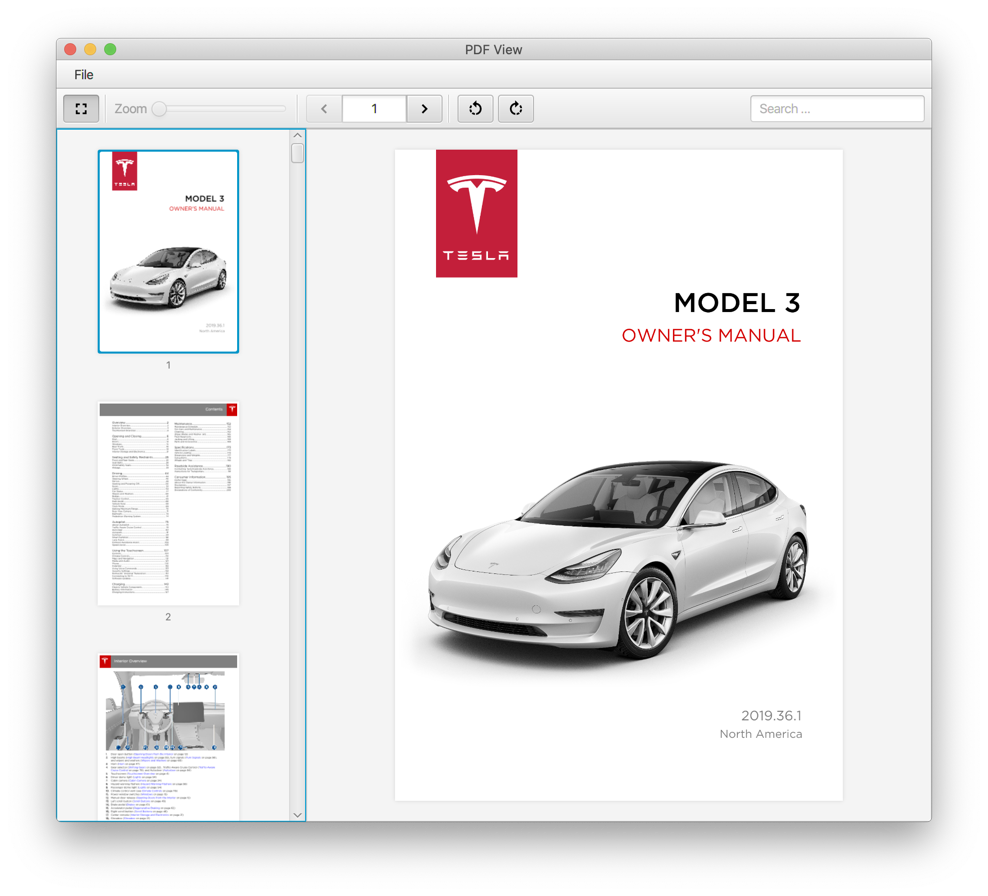
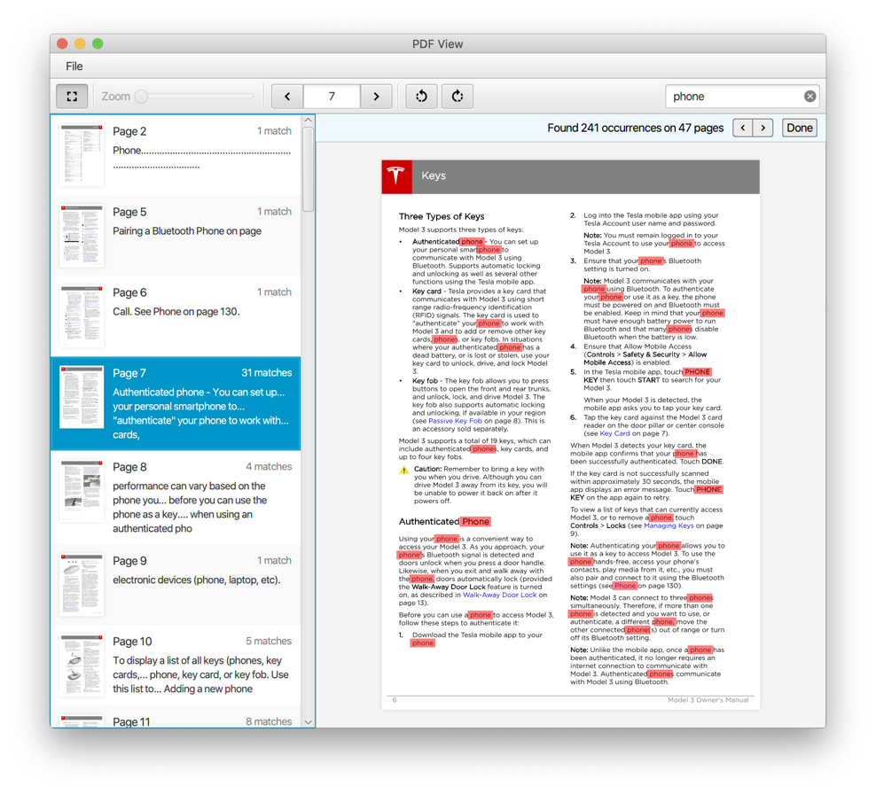
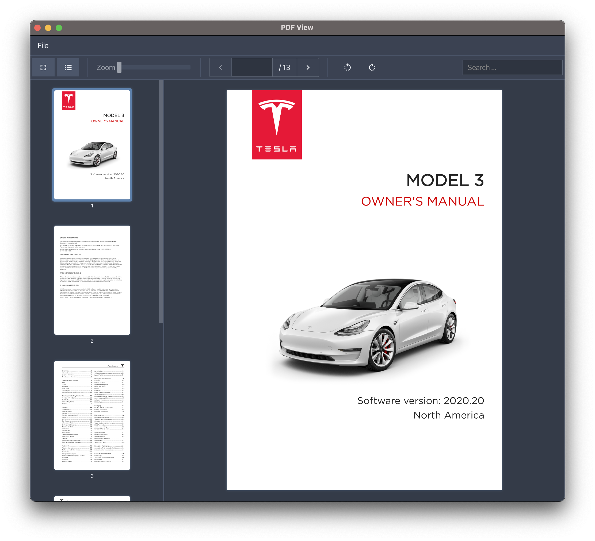
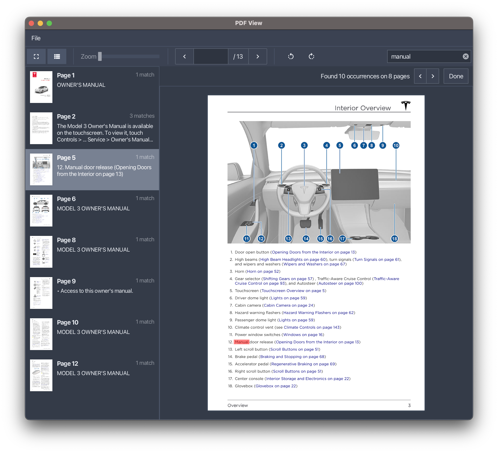

# PDFViewFX

A custom control that allows an application to display PDF files. The control utilizes Apache's PDFBox project.

## Search
The view has excellent built-in search capabilities.

## AtlantaFX
If you want to use **_AtlantaFX_** for your application then copy the stylesheet called [pdf-view-atlantafx.css](pdfviewfx-demo/src/main/resources/pdf-view-atlanta.css) 
from the demo module into your project. You will need to add it to the list of stylesheets that you 
are attaching to your application's scene. For more information on **_AtlantaFX_** please see the
[AtlantaFX](https://github.com/mkpaz/AtlantaFX)project.

## Running the demo

You can run the demos using Maven by typing the following line into your terminal:

    mvn javafx:run -f pdfviewfx-demo/pom.xml
