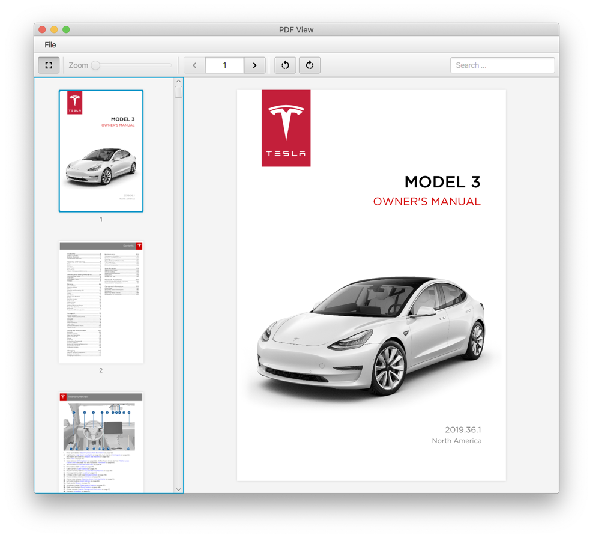
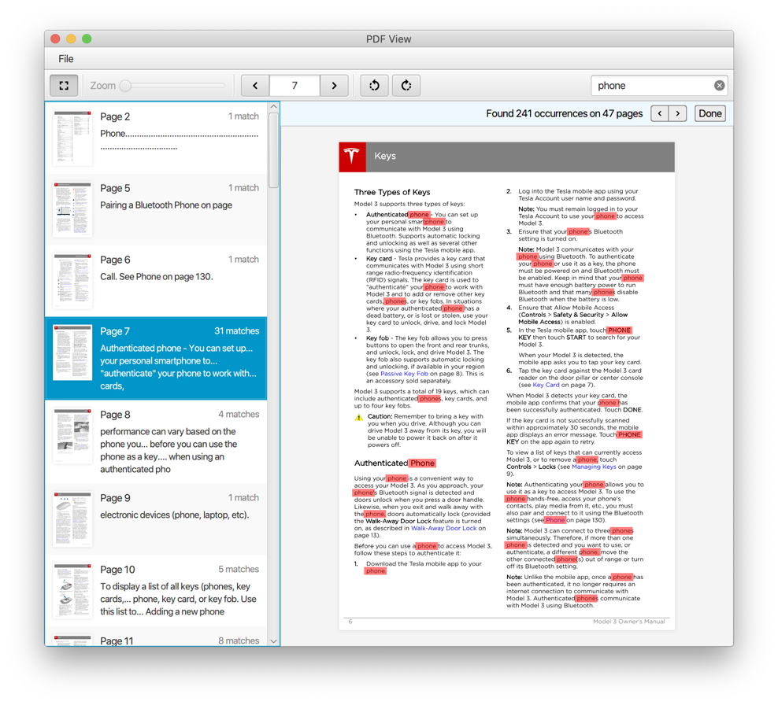
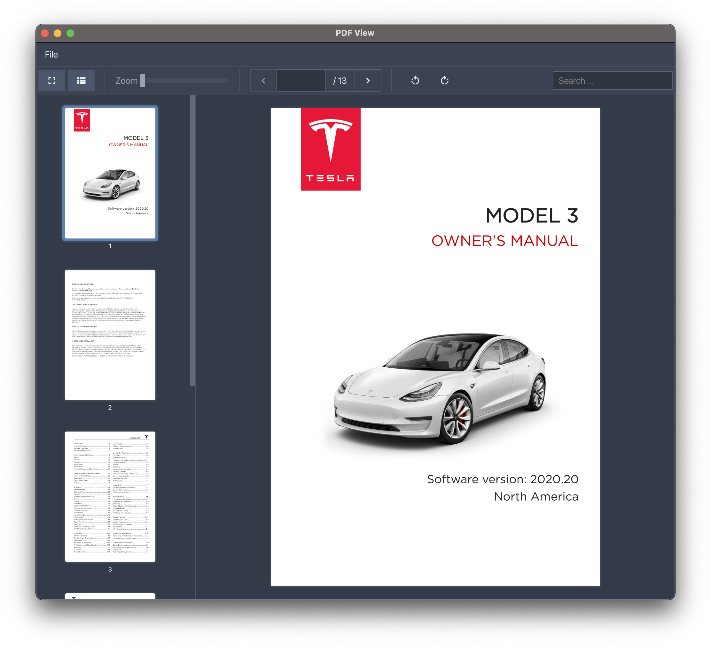
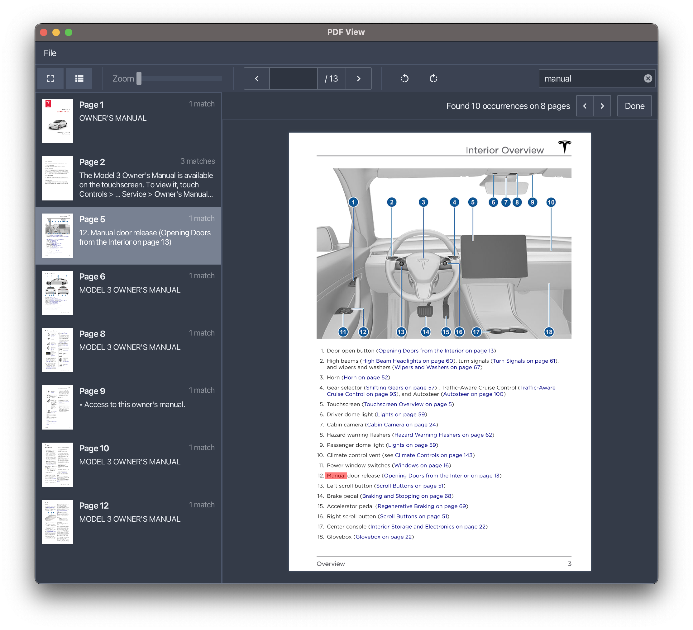

[](https://www.jfx-central.com/libraries/pdfviewfx)

# PDFViewFX

A custom control that allows an application to display PDF files. The control utilizes Apache's PDFBox project.



## Search
The view has excellent built-in search capabilities.



## AtlantaFX
If you want to use **_AtlantaFX_** for your application then copy the stylesheet called [pdf-view-atlantafx.css](pdfviewfx-demo/src/main/resources/pdf-view-atlanta.css) 
from the demo module into your project. You will need to add it to the list of stylesheets that you 
are attaching to your application's scene. For more information on **_AtlantaFX_** please see the
[AtlantaFX](https://github.com/mkpaz/AtlantaFX) project.




## Internationalization

All texts shown by the view (tooltips, labels, prompt text, search result summaries, context menu) are
looked up in a resource bundle. The library ships with translations for the following languages:

English (default), German, French, Spanish, Italian, Chinese (Simplified), Japanese, Finnish, Swedish,
Danish, Dutch, Portuguese, Czech, Hungarian, Polish, Greek.

The bundle for the default locale of the JVM is used automatically. Applications that want to add a
language or override individual texts can set their own bundle:

```java
PDFView view = new PDFView();
view.setResourceBundle(ResourceBundle.getBundle("com/acme/my-pdf-view-texts", Locale.forLanguageTag("no")));
```

Keys that are missing in a custom bundle are looked up in the default bundle of the library, so a custom
bundle only has to define the texts that it actually wants to change. The keys used by the view can be
found in [pdf-view.properties](pdfviewfx/src/main/resources/com/dlsc/pdfviewfx/pdf-view.properties).

Please note that the texts are read only once, when the view creates its skin. The bundle therefore has
to be set before the view gets displayed for the first time. Switching the language at runtime is not
supported.

## Running the demo

You can run the demos by using the project's Maven wrapper by typing the following line into your terminal:

    ./mvnw javafx:run -f pdfviewfx-demo/pom.xml
